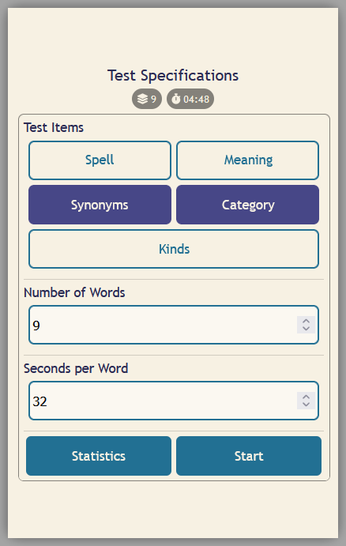
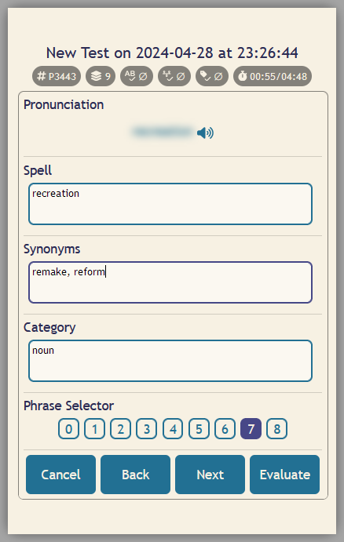
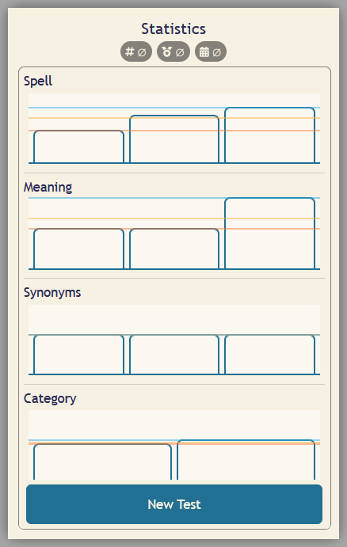

# English Practice Application

	&#9;&#9;&#9;

This repository contains all the necessary codes for implementing a web application that helps in practicing English. The web application provides tools for creating tests in spelling, meaning, synonyms, category, and grammatical function of different words. The UI is designed to be self-explanatory. You can find a demo [here](http://demo-engpractice.atwebpages.com/).

# How to Implement the Web Application?
Except for the [demo-db.sql](demo-db.sql), upload all the content of this repository into your hosting area. Then, modify [functions.php](backend/functions.php) and add your MySQL database credentials. That’s it! You now have your own web application! Just remember that, to start, you can import [demo-db.sql](demo-db.sql) into to you database.
